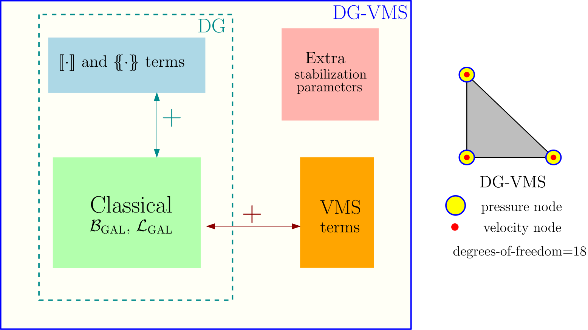

<center> <h1> Codes for composable block solver methodologies for the four-field double porosity/permeability model </h1> </center>

Codes for 
><i>Mohammad S. Joshaghani, Justin Chang, Kalyana B. Nakshatrala, and Matthew G. Knepley</i>, "On composable block solvers and performance spectrum analysis for double porosity/permeability model" [Journal of Computational Physics](https://www.sciencedirect.com/science/article/pii/S0021999119301378), 386: 428-466, 2019. [Available in [arXiv](https://arxiv.org/abs/1808.08328)]
>
><details><summary>[Abstract]</summary>
><p> 
>The objective of this paper is twofold. First, we propose two composable block solver methodologies to solve the discrete systems that arise from finite element discretizations of the double porosity/permeability (DPP) model. The DPP model, which is a four-field mathematical model, describes the flow of a single-phase incompressible fluid in a porous medium with two distinct pore-networks and with a possibility of mass transfer between them. Using the composable solvers feature available in PETSc and the finite element libraries available under the Firedrake Project, we illustrate two different ways by which one can effectively precondition these large systems of equations. Second, we employ the recently developed performance model called the Time-Accuracy-Size (TAS) spectrum to demonstrate that the proposed composable block solvers are scalable in both the parallel and algorithmic sense. Moreover, we utilize this spectrum analysis to compare the performance of three different finite element discretizations (classical mixed formulation with H(div) elements, stabilized continuous Galerkin mixed formulation, and stabilized discontinuous Galerkin mixed formulation) for the DPP model. Our performance spectrum analysis demonstrates that the composable block solvers are fine choices for any of these three finite element discretizations. Sample computer codes are provided to illustrate how one can easily implement the proposed block solver methodologies through PETSc command line options. 
></p>
></details>

This repository provides computer codes for two recently proposed composable block solver methodologies to solve the discrete systems that arise from double porosity/permeability (DPP) model. 
Time-Accuracy-Size (TAS) spectrum performance model is employed to (i) demonstrate that solvers are scalable in both the parallel and algorithmic sense (ii) compare the performance of three different finite element discretizations (classical mixed formulation with H(div) elements, stabilized continuous Galerkin mixed formulation, and stabilized discontinuous Galerkin mixed formulation) for the DPP model. More details are discussed in the paper.

<h2> Large scale problems in geophysical systems </h2>
The <a href="#large_images"> problems that arise in subsurface modeling</a> and other applications involving flow through porous media are large-scale, multiphysics, and multiscale. These problems cannot be solved on a standard desktop or by employing direct solvers; as such a computation will be prohibitively expensive. 
</br>

<table class="tab">
<tr>
 <td>Karst network</td> 
 <td> Geothermal energy</td> 
 <td>Carbon capture and storage</td> 
 <td>Hydrocarbon recovery</td> 
 <td>Contaminant hydrology</td> 
 <td>Fuel cell</td> 
</tr>
<tr>
  <td> </td>
  <td>           </td>
  <td>             </td>
  <td>                          </td>
  <td>        </td>
  <td>                  </td>
</tr>
</table>


<!-- <style> -->
<!-- .tab {border-collapse:collapse;} -->
<!-- .tab .first {border-bottom:1px solid #EEE;} -->
<!-- .tab .second {border-top:1px solid #CCC;box-shadow: inset 0 1px 0 #CCC;}​ -->
<!-- </style> -->

<!-- <div class="row" id="large_images"> -->
<!--   <div class="column"> -->
<!--   <center> Karst network </center> -->
<!--      -->
<!--   </div> -->
<!--   <div class="column"> -->
<!--   <center> Geothermal energy</center> -->
<!--      -->
<!--   </div> -->
<!--   <div class="column"> -->
<!--   <center>Carbon capture and storage</center> -->
<!--      -->
<!--   </div> -->
<!-- </div> -->
<!-- <div class="row"> -->
<!--   <div class="column"> -->
<!--   <center>Hydrocarbon recovery</center> -->
<!--      -->
<!--   </div> -->
<!--   <div class="column"> -->
<!--   <center>contaminant hydrology</center> -->
<!--      -->
<!--   </div> -->
<!--   <div class="column"> -->
<!--   <center>Fuel cell</center> -->
<!--      -->
<!--   </div> -->
<!-- </div> -->

## <abbr title='Understanding how to optimally utilize the computational and memory resources on modern hardware architecture is vital to achieving High Performance Computing'> High performance computing (HPC)</abbr>
Large-scale problems from subsurface modeling are routinely tackled using 
 scalable HPC techniques, efficient parallel computing tools, and advanced solvers and preconditioners.

<br>


Figure shows the different levels of hardware of a cluster/supercomputer, together with the associated memory latency and size, debugging tools, as well as the type of parallelism to exploit them. The numbers are expressed in terms of orders of magnitude and pretend to be only heuristic as they are system dependent.


Figure shows architecture of a computing cluster with n nodes. The zoom-in view illustrates the modern architecture of a 4-core processor/node.
## Various finite elements (FEs) for solving subsurface problems
<details open><summary> <big> <abbr title='Classes of H(div) finite element discretization such as RT, RTN, BDM, BDFM'><b>H(div) FE</b></abbr></big>
</summary>
Classical mixed formulation such as RT, RTN, BDM, and BDFM that degree-of-freedoms are not associated with vertices.
It is frequently used in subsurface modeling. <br>
Features:
<ul>
<li>
<font color=blue> Low degree-of-freedom per element </font>
</li>
<li>
<font color=blue>Can handle highly heterogeneous domains</font>
</li>
<li>
<font color=blue>Preserves local mass balance</font>
</li>
<li>
<font color=red>Give rise to indefinite linear system</font>
</li>
<li>
<font color=red>Fails under 3D meshes with non-constant Jacobians</font>
</li>
</ul>


</details>

<details open><summary> <big> <abbr title='Stabilized mixed continuous Galerkin formulation (CG-VMS)'><b>CG-VMS FE</b></abbr></big>
</summary>
This formulation is know as THE finite element method (based on continuous basis functions) that is combined with 
variational multiscale (VMS) method.<br>
Features:
<ul>
<li>
<font color=blue>Flexible interpolation order for primary unknowns</font>
</li>
<li>
<font color=blue>High order accuracy</font>
</li>
<li>
<font color=red>Inability to handle highly heterogeneous domains</font>
</li>
<li>
<font color=red>Poor local mass balance conservation</font>
</li>
</ul>


</details>
<details open><summary> <big> <abbr title='Stabilized mixed discontinuous Galerkin formulation (DG-VMS)'><b>DG-VMS FE</b></abbr></big>
</summary>
Inherits attractive features of both FE and FV methods by allowing discontinuous basis functions <br>
Features:
<ul>
<li>
<font color=blue>Flexible interpolation order for primary unknowns </font>
</li>
<li>
<font color=blue>Easily handle 3D non-constant Jacobian elements and does not suffer from grid distortion</font>
</li>
<li>
<font color=blue>Does not suffer from numerical instabilities (due to fluxes)</font>
</li>
<li>
<font color=blue>Can handle highly heterogeneous domains</font>
</li>
<li>
<font color=blue>Preserves local mass balance</font>
</li>
<li>
<font color=red>Requires penalty parameters that are problem dependent</font>
</li>
<li>
<font color=red>High degrees-of-freedom per element</font>
</li>
</ul>


</details>
<details open><summary> <big> <abbr title='Hybridizable discontinuous Galerkin formulation (HDG)'><b>HDG FE</b></abbr></big>
</summary>
Inherits attractive features of both CG and DG methods by employing classic static condensation and local post-processing techniques. <br>
Features:
<ul>
<li>
<font color=blue>Low degrees-of-freedom</font>
</li>
<li>
<font color=blue>Can easily handle diffusion- and convection-dominated problems</font>
</li>
<li>
<font color=blue>Scales well for higher polynomial orders</font>
</li>
<li>
<font color=blue>Preserves local mass balance</font>
</li>
<li>
<font color=red>Higher setup-up cost</font>
</li>
</ul>


</details>

## Solver methodologies
Different precondditioning strategies (e.g., fieldsplit and scalesplit) are implemented seamlessly using the existing [PETSc’s composable solver](https://www.mcs.anl.gov/petsc/documentation/linearsolvertable.html) options. The corresponding codes and PETSc command-line options can be found [here](./Codes/).


Time-accuracy-size performance model is employed to understand how software implementations, hardware architectures, and
various numerical discretizations (e.g., CG-VMS, DG-VMS, RT0) affect the performance of a solver.

## Project tree
```
./Codes
├── 2D
│   ├── 2D_composable_solver_CG.py
│   ├── 2D_composable_solver_DG.py
│   ├── 2D_composable_solver_RT0.py
│   ├── Bash
│   │   └── Bash.sh
│   └── Strongscaling
├── 3D
│   ├── 3D_composable_solvers_CG.py
│   ├── 3D_composable_solvers_DG.py
│   ├── 3D_composable_solvers_RT0.py
│   ├── Bash
│   │   └── Bash.sh
│   └── Strongscaling
│       ├── Same_dof
│       │   └── StrongBash.sh
│       └── Same_hsize
│           └── StrongBash.sh
└── PETSc_command_line

8 directories, 11 files
```


## Related links
<ul>
<li>

My [poster presentation](./Figures/Poster_for_SIAM_CSE19.pdf) at SIAM Conference on Computer Science and Engineering, Spokane, 2019. 
</li>
<li>

My [talk](https://www.pathlms.com/siam/courses/11267/sections/14637/video_presentations/128789) at SIAM Conference on Mathematical and Computational Issues in the Geosciences, Houston, TX, 2019.
</li>
</ul>

